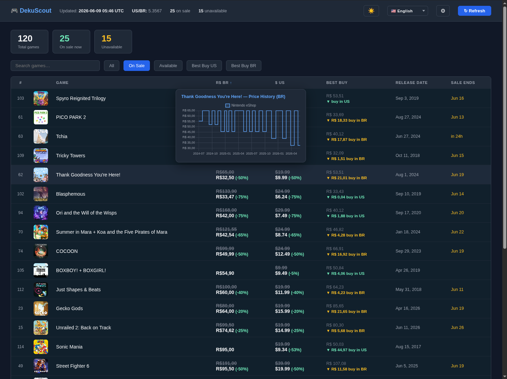
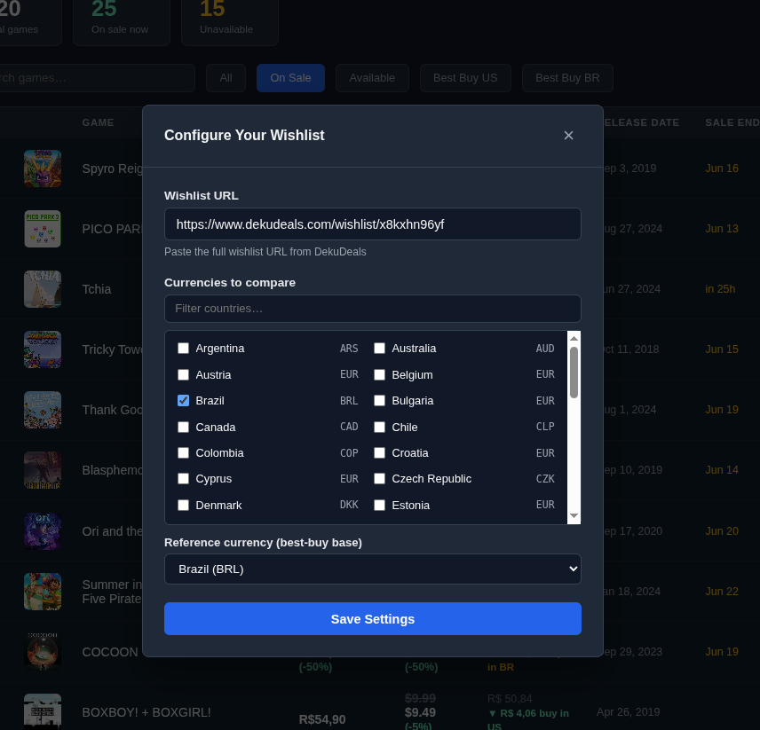

# DekuScout

A self-hosted web app that tracks your [DekuDeals](https://www.dekudeals.com) wishlist and compares prices across multiple regional storefronts, showing you where to buy each game at the lowest converted price.

## Live Demo

**[https://dekuscout.fernandoglatz.com/demo](https://dekuscout.fernandoglatz.com/demo)**

Uses the wishlist at [dekudeals.com/wishlist/x8kxhn96yf](https://www.dekudeals.com/wishlist/x8kxhn96yf).

### Try it locally

Visit `/demo` on any running instance to auto-configure the demo wishlist and go straight to the dashboard — no setup screen required. If a wishlist is already configured the `/demo` route simply redirects to `/` without overwriting it.

## Features

- Scrapes your DekuDeals public wishlist and displays all games in a single dashboard
- Compares prices across any combination of supported regions (40+ countries)
- Converts regional prices to your reference currency using live exchange rates
- Highlights the best-buy region and how much you save vs. the reference price
- Shows sale badges, sale end dates, and release dates
- Caches game data locally (SQLite) with configurable TTL — no repeated scraping
- Displays and caches game cover art locally
- Price history chart per game (hover on desktop, tap on mobile)
- Search, filter (All / On Sale / Available / Best Buy per region), and sort by any column
- Drag column headers to reorder columns (works with mouse, touch, and pen)
- Filter, sort, and column order persisted across page loads
- Mobile-responsive layout — card list view, hamburger menu, and bottom-sheet price history
- Dark/light theme toggle
- Internationalization (English, Spanish, Portuguese, Japanese)
- Fully configurable through the UI — no config file editing required

## Screenshots





## Quick Start

### Docker Compose (recommended)

Copy `.env.example` to `.env` and fill in your values:

```
WISHLIST_URL=https://www.dekudeals.com/wishlist/<your-code>
TZ=America/Sao_Paulo
```

Then run:

```bash
docker compose up -d
```

Open [http://localhost:5000](http://localhost:5000) in your browser. On first load, enter your wishlist code or URL in the setup screen.

### Running Locally

```bash
pip install -r requirements.txt
python -m app
```

The app listens on `http://0.0.0.0:5000`.

## Configuration

All runtime settings are stored in the local SQLite database and can be changed from the web UI:

| Setting             | Description                                                         |
| ------------------- | ------------------------------------------------------------------- |
| Wishlist URL        | Your DekuDeals public wishlist URL or code                          |
| Selected currencies | Which regional storefronts to show                                  |
| Reference currency  | The currency used for price comparisons and "best buy" calculations |

Environment variables (used at startup / for Docker):

| Variable       | Default  | Description                                      |
| -------------- | -------- | ------------------------------------------------ |
| `WISHLIST_URL` | —        | Pre-seeds the wishlist URL on first run          |
| `DATA_DIR`     | `./data` | Directory for the SQLite database and icon cache |

## User Management

DekuScout supports multi-user deployments via an auth proxy that injects an `X-Forwarded-User` header containing the user's email address. When this header is present, each user gets a fully isolated SQLite database (config, wishlist, games cache, price history). Icons are shared globally across users.

When the header is absent, the app falls back to a single shared `session.db` — preserving local / single-user behavior unchanged.

### Auth Proxy Setup

Configure your reverse proxy (e.g. Authelia, Authentik, oauth2-proxy) to inject the header on every request:

```
X-Forwarded-User: user@example.com
```

DekuScout reads this header on each request, computes a SHA-256 hash of the email address, and stores that user's data under:

```
data/
  session.db               ← default (no header / local dev)
  users/
    <sha256(email)>/
      session.db           ← per-user isolated database
  icons/                   ← shared globally
```

The user's email is displayed as a badge in the header of the UI. No extra configuration is required — user databases are created and migrated automatically on first access.

## Architecture

```
app/
├── __init__.py     # Flask app factory
├── config.py       # Constants, country/currency map
├── scraper.py      # DekuDeals HTML scraping, icon download
├── parsing.py      # Date/price string parsing helpers
├── db.py           # SQLite persistence (cookies, game cache, config)
├── exchange.py     # Live exchange rate fetching (open.er-api.com)
├── web.py          # Flask routes and REST endpoints
└── templates/
    └── index.html  # Single-page UI
```

Data is persisted in a single SQLite file (`DATA_DIR/session.db`). Game data is cached for 30 minutes; price history is cached for 6 hours. Exchange rates are fetched at most once per hour.

## Running Tests

```bash
pytest
```

## Docker Image

Pre-built images are published to `ghcr.io/fernandoglatz/dekuscout`. The image exposes port `5000` and expects a writable volume at `/data`.

```bash
docker pull ghcr.io/fernandoglatz/dekuscout:latest
```
